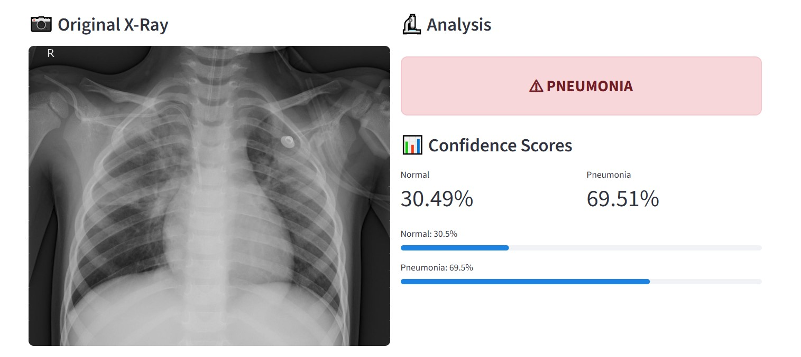
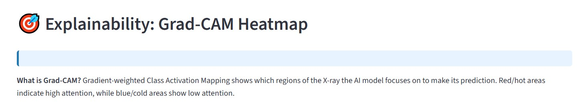
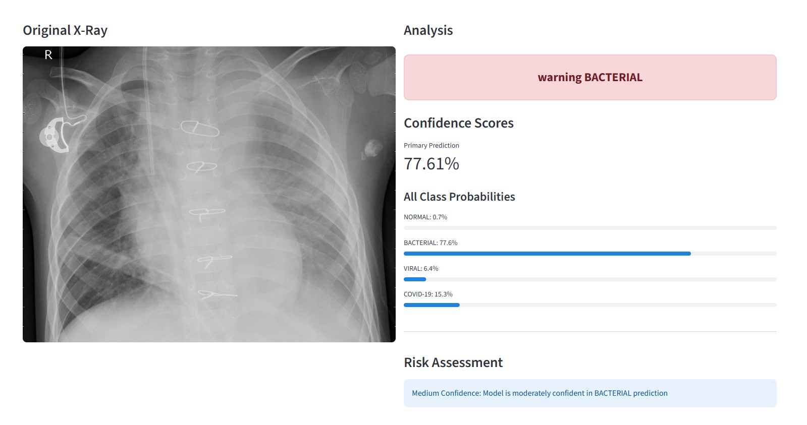

# 🏥 AI-Powered Healthcare Disease Detection

[](https://github.com/kitsakisGk/Healthcare-Detection/actions/workflows/ci.yml)
[](https://opensource.org/licenses/MIT)
[](https://www.python.org/downloads/)
[](https://huggingface.co/spaces/kitsakisG/Pneumonia-Detection)
[](https://www.docker.com/)

**Multi-Disease Detection System for Medical Imaging**

Production-ready deep learning platform for automated disease detection from medical images, currently supporting pneumonia classification with plans for additional diagnostic capabilities.

## Overview

This project provides AI-powered diagnostic assistance for healthcare professionals using state-of-the-art deep learning models. The system is designed for clinical deployment with a focus on accuracy, interpretability, and reliability.

## Current Capabilities

### Pneumonia Detection (4-Class Classification)
- **NORMAL**: Healthy chest X-rays
- **BACTERIAL**: Bacterial pneumonia infection
- **VIRAL**: Viral pneumonia infection
- **COVID-19**: COVID-19 pneumonia

**Performance**: 99.14% F1 Score (Ensemble Model)

> **Note**: Pre-trained models are not included in the repository due to size constraints. Train your own models using the Interactive Training interface or the provided Colab notebook.

## Features

- **Multi-Model Ensemble**: Combines EfficientNet-B3, ResNet152, and DenseNet201
- **Explainable AI**: Grad-CAM visualization showing model decision areas
- **Clinical-Ready Interface**: Streamlit web application for easy deployment
- **Production Deployment**: Docker support and Hugging Face Spaces integration
- **Comprehensive Training**: Google Colab notebooks for GPU-accelerated training

## Screenshots

### Web Application Interface


*Multi-class pneumonia prediction with confidence scores*


*Grad-CAM heatmaps showing model decision areas*


*Detailed analysis with probability distributions*

## Quick Start

### Installation

```bash
git clone https://github.com/kitsakisGk/Healthcare-Detection.git
cd Healthcare-Detection
pip install -r requirements.txt
```

### Run Web Application

```bash
streamlit run app/streamlit_app.py
```

Open your browser to `http://localhost:8501`

## Documentation

📚 **Complete Guides Available:**

- **[USAGE.md](USAGE.md)** - Complete usage guide (web app, training, evaluation, deployment)
- **[TRAINING_LOCAL.md](TRAINING_LOCAL.md)** - Train models on your own computer (CPU/GPU guide)
- **[EXPANDING.md](EXPANDING.md)** - Add more diseases (TB, cancer, retinopathy, etc.)
- **[data/README.md](data/README.md)** - Dataset organization and download instructions

## Project Structure

```
Healthcare-Detection/
├── app/                    # Web applications
│   ├── streamlit_app.py        # Main detection app
│   └── interactive_training.py # Training interface
├── src/                    # Source code
│   ├── models/                 # Model architectures
│   ├── data/                   # Data processing
│   ├── training/               # Training logic
│   └── utils/                  # Utilities
├── deployment/             # Deployment configs
│   ├── docker/                 # Docker files
│   └── huggingface/            # HF Spaces
├── scripts/                # Training/evaluation scripts
├── notebooks/              # Google Colab notebooks
├── models/                 # Trained model weights
├── data/                   # Dataset directory
└── docs/                   # Documentation & screenshots
```

## Technology Stack

- **Framework**: PyTorch 2.0+
- **Models**: EfficientNet-B3, ResNet152, DenseNet201, Ensemble
- **Web App**: Streamlit
- **Deployment**: Docker, Hugging Face Spaces
- **Training**: Google Colab (Free T4 GPU)

## Roadmap

### Phase 1: Pneumonia Detection ✓
- Multi-class chest X-ray classification
- Ensemble model with 99%+ accuracy
- Grad-CAM explainability
- Web application deployment

### Phase 2: Additional Diagnostics (Planned)
- Tuberculosis detection
- Lung cancer screening
- Cardiovascular disease assessment
- Diabetic retinopathy detection
- Multi-organ disease classification

## Model Performance

| Model | F1 Score | Accuracy | Parameters |
|-------|----------|----------|------------|
| **Ensemble** | **99.14%** | **99.14%** | 876M |
| EfficientNet-B3 | 98.18% | 98.18% | 132M |
| ResNet152 | 97.53% | 97.53% | 661M |
| DenseNet201 | 86.69% | 86.69% | 84M |

## Deployment

### Live Demo

Try the live application: **[Hugging Face Spaces](https://huggingface.co/spaces/kitsakisG/Pneumonia-Detection)**

### Docker Deployment

```bash
# Build and run with Docker
cd deployment/docker
docker-compose up -d

# Or build manually from project root
docker build -f deployment/docker/Dockerfile -t healthcare-detection .
docker run -p 8501:8501 -v $(pwd)/models:/app/models healthcare-detection
```

### CI/CD

This project includes automated CI/CD pipelines:
- ✅ Automated testing on push
- ✅ Code quality checks
- ✅ Docker image building
- ✅ Auto-deployment to Hugging Face Spaces

## License

MIT License

## Author

Georgios Kitsakis

## Acknowledgments

Built with state-of-the-art deep learning architectures and trained on publicly available medical imaging datasets.
